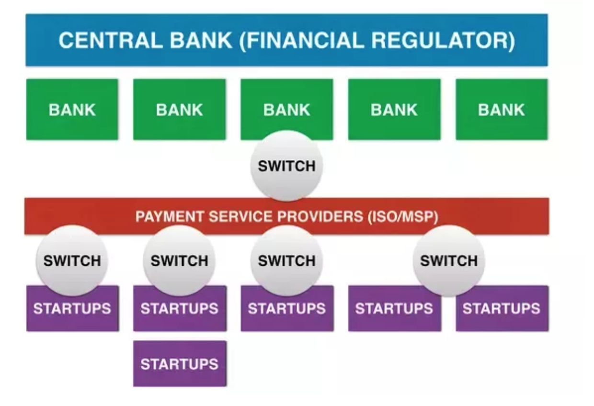

## Notes about the payments industry:

https://www.quora.com/How-does-the-payments-ecosystem-work-What-does-the-payments-workflow-look-like-from-the-merchant%E2%80%99s-card-payment-to-the-acquirer-What-are-the-roles-of-each-of-the-main-firms-in-the-space-like-First-Data-PayPal-Neteller-Square-Visa-etc/answer/Faisal-Khan-1

all payments (except bitcoin shit) go through a bank.

In most cases, Startups work with a Payment Service Provider who work with Banks, who are regulated by the Central Banks.

[What exactly happens when a wire transfer is made? How does the money travel from the sender's account to the recipient's account? How much time does each step take? What regulatory measures are in place, if any?](https://www.quora.com/How-does-the-settlement-of-payments-work-in-banks-Specifically-how-do-payment-systems-that-are-connected-to-multiple-banks-actually-settle-the-amount-between-two-banks/answer/Faisal-Khan-1)

[How does money transfer between banks and different countries work?](https://www.quora.com/What-exactly-happens-when-a-wire-transfer-is-made-How-does-the-money-travel-from-the-senders-account-to-the-recipients-account-How-much-time-does-each-step-take-What-regulatory-measures-are-in-place-if-any/answer/Faisal-Khan-1)

[What is a Paypal account? Is it a kind of bank account which is maintained for demand deposits?](https://www.quora.com/What-is-a-Paypal-account-Is-it-a-kind-of-bank-account-which-is-maintained-for-demand-deposits/answer/Faisal-Khan-1)

[How do credit card companies make money?](https://www.quora.com/How-do-credit-card-companies-make-money)
